# Project 3

## 1. Inspect the data

Upload data

```
curl -L https://d28rh4a8wq0iu5.cloudfront.net/bioinfo/SRR292678sub_S1_L001_R1_001.fastq.gz | gunzip > SRR292678sub_S1_L001_R1_001.fastq
curl -L https://d28rh4a8wq0iu5.cloudfront.net/bioinfo/SRR292678sub_S1_L001_R2_001.fastq.gz | gunzip > SRR292678sub_S1_L001_R2_001.fastq

curl -L https://d28rh4a8wq0iu5.cloudfront.net/bioinfo/SRR292862_S2_L001_R1_001.fastq.gz | gunzip > SRR292862_S2_L001_R1_001.fastq
curl -L https://d28rh4a8wq0iu5.cloudfront.net/bioinfo/SRR292862_S2_L001_R2_001.fastq.gz | gunzip > SRR292862_S2_L001_R2_001.fastq

curl -L https://d28rh4a8wq0iu5.cloudfront.net/bioinfo/SRR292770_S1_L001_R1_001.fastq.gz | gunzip > SRR292770_S1_L001_R1_001.fastq
curl -L https://d28rh4a8wq0iu5.cloudfront.net/bioinfo/SRR292770_S1_L001_R2_001.fastq.gz | gunzip > SRR292770_S1_L001_R2_001.fastq
```

Count basic statistics
```
seqkit stats SRR292678sub_S1_L001_R1_001.fastq
seqkit stats SRR292678sub_S1_L001_R2_001.fastq

seqkit stats SRR292862_S2_L001_R1_001.fastq
seqkit stats SRR292862_S2_L001_R2_001.fastq

seqkit stats SRR292770_S1_L001_R1_001.fastq
seqkit stats SRR292770_S1_L001_R2_001.fastq
```
Output

```
file                               format  type   num_seqs      sum_len  min_len  avg_len  max_len
SRR292678sub_S1_L001_R1_001.fastq  FASTQ   DNA   5,499,346  494,941,140       90       90       90
file                               format  type   num_seqs      sum_len  min_len  avg_len  max_len
SRR292678sub_S1_L001_R2_001.fastq  FASTQ   DNA   5,499,346  494,941,140       90       90       90

file                            format  type   num_seqs      sum_len  min_len  avg_len  max_len
SRR292862_S2_L001_R1_001.fastq  FASTQ   DNA   5,102,041  250,000,009       49       49       49
file                            format  type   num_seqs      sum_len  min_len  avg_len  max_len
SRR292862_S2_L001_R2_001.fastq  FASTQ   DNA   5,102,041  250,000,009       49       49       49

file                            format  type   num_seqs      sum_len  min_len  avg_len  max_len
SRR292770_S1_L001_R1_001.fastq  FASTQ   DNA   5,102,041  250,000,009       49       49       49
file                            format  type   num_seqs      sum_len  min_len  avg_len  max_len
SRR292770_S1_L001_R2_001.fastq  FASTQ   DNA   5,102,041  250,000,009       49       49       49
```

Built fastqc report

```
fastqc -o . SRR292678sub_S1_L001_R1_001.fastq 
fastqc -o . SRR292678sub_S1_L001_R2_001.fastq 

fastqc -o . SRR292862_S2_L001_R1_001.fastq 
fastqc -o . SRR292862_S2_L001_R2_001.fastq 

fastqc -o . SRR292770_S1_L001_R1_001.fastq 
fastqc -o . SRR292770_S1_L001_R2_001.fastq 
```

```
unzip SRR292678sub_S1_L001_R1_001_fastqc.zip
unzip SRR292678sub_S1_L001_R2_001_fastqc.zip

unzip SRR292862_S2_L001_R1_001_fastqc.zip
unzip SRR292862_S2_L001_R2_001_fastqc.zip

unzip SRR292770_S1_L001_R1_001_fastqc.zip
unzip SRR292770_S1_L001_R2_001_fastqc.zip
```

Pull the tables from the report
```
grep -A 8 '>>Basic Statistics' SRR292678sub_S1_L001_R1_001_fastqc/fastqc_data.txt | \
sed 's/^>>//' | \
awk -F'\t' 'BEGIN {print "| Measure                          | Value                       |\n|--------------------------------|----------------------------|"} \
/^[^#]/ && NF == 2 {printf "| %-30s | %-26s |\n", $1, $2}'

grep -A 8 '>>Basic Statistics' SRR292678sub_S1_L001_R2_001_fastqc/fastqc_data.txt | \
sed 's/^>>//' | \
awk -F'\t' 'BEGIN {print "| Measure                          | Value                       |\n|--------------------------------|----------------------------|"} \
/^[^#]/ && NF == 2 {printf "| %-30s | %-26s |\n", $1, $2}'


grep -A 8 '>>Basic Statistics' SRR292862_S2_L001_R1_001_fastqc/fastqc_data.txt | \
sed 's/^>>//' | \
awk -F'\t' 'BEGIN {print "| Measure                          | Value                       |\n|--------------------------------|----------------------------|"} \
/^[^#]/ && NF == 2 {printf "| %-30s | %-26s |\n", $1, $2}'

grep -A 8 '>>Basic Statistics' SRR292862_S2_L001_R2_001_fastqc/fastqc_data.txt | \
sed 's/^>>//' | \
awk -F'\t' 'BEGIN {print "| Measure                          | Value                       |\n|--------------------------------|----------------------------|"} \
/^[^#]/ && NF == 2 {printf "| %-30s | %-26s |\n", $1, $2}'


grep -A 8 '>>Basic Statistics' SRR292770_S1_L001_R1_001_fastqc/fastqc_data.txt | \
sed 's/^>>//' | \
awk -F'\t' 'BEGIN {print "| Measure                          | Value                       |\n|--------------------------------|----------------------------|"} \
/^[^#]/ && NF == 2 {printf "| %-30s | %-26s |\n", $1, $2}'

grep -A 8 '>>Basic Statistics' SRR292770_S1_L001_R2_001_fastqc/fastqc_data.txt | \
sed 's/^>>//' | \
awk -F'\t' 'BEGIN {print "| Measure                          | Value                       |\n|--------------------------------|----------------------------|"} \
/^[^#]/ && NF == 2 {printf "| %-30s | %-26s |\n", $1, $2}'
```

<br/>
Data does not require cutting, because it shows good quality.

**SRR292678sub_S1_L001_R1_001_fastqc.fastq** 
<div style="display: flex; gap: 10px; align-items: center;">
    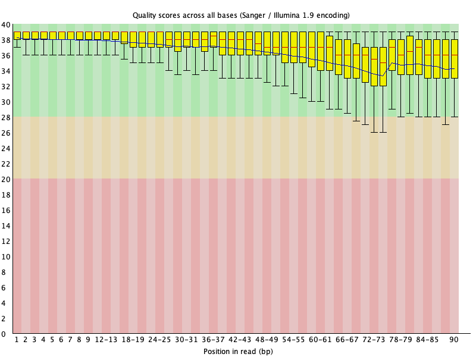
    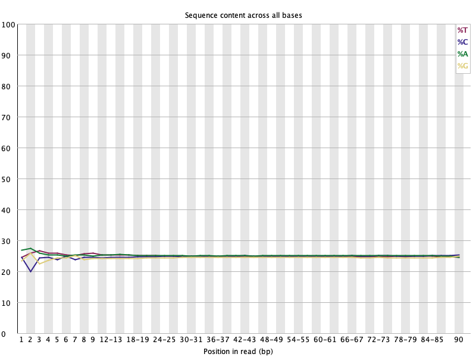
    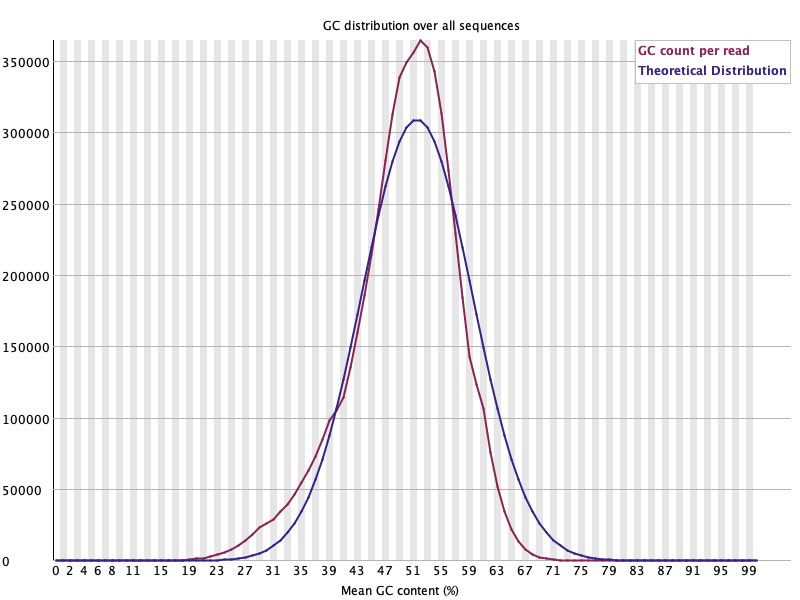
</div> <br/>

| Measure                          | Value                       |
|--------------------------------|----------------------------|
| Basic Statistics               | pass                       |
| Filename                       | SRR292678sub_S1_L001_R1_001.fastq |
| File type                      | Conventional base calls    |
| Encoding                       | Sanger / Illumina 1.9      |
| Total Sequences                | 5499346                    |
| Total Bases                    | 494.9 Mbp                  |
| Sequences flagged as poor quality | 0                          |
| Sequence length                | 90                         |


**SRR292678sub_S1_L001_R2_001_fastqc.fastq**
<div style="display: flex; gap: 10px; align-items: center;">
    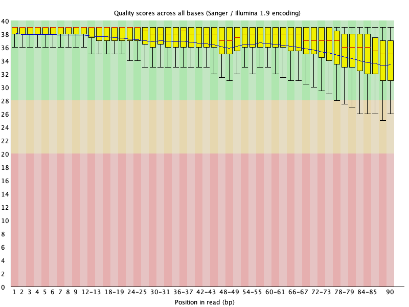
    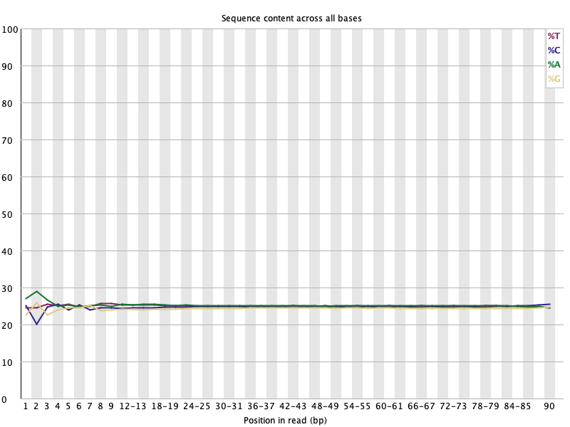
    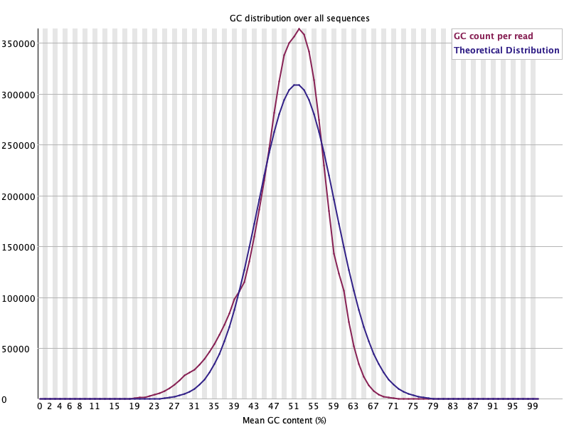
</div> <br/>

| Measure                          | Value                       |
|--------------------------------|----------------------------|
| Basic Statistics               | pass                       |
| Filename                       | SRR292678sub_S1_L001_R2_001.fastq |
| File type                      | Conventional base calls    |
| Encoding                       | Sanger / Illumina 1.9      |
| Total Sequences                | 5499346                    |
| Total Bases                    | 494.9 Mbp                  |
| Sequences flagged as poor quality | 0                          |
| Sequence length                | 90                         |


**SRR292862_S2_L001_R1_001_fastqc.fastq**
<div style="display: flex; gap: 10px; align-items: center;">
    
    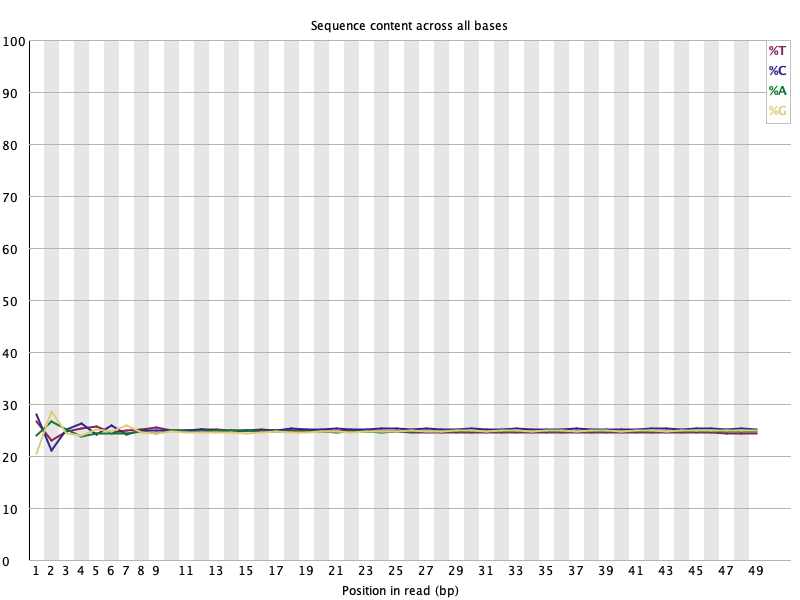
    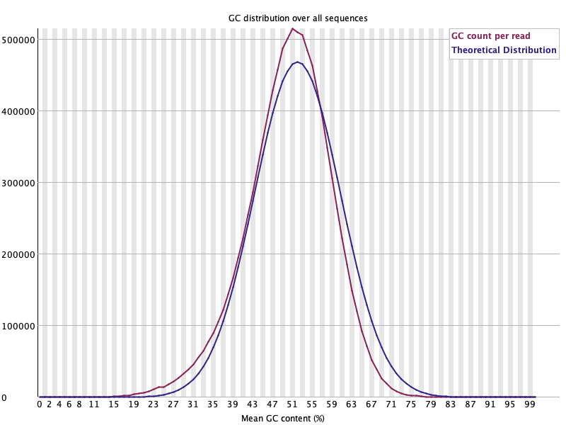
</div> <br/>

| Measure                          | Value                       |
|--------------------------------|----------------------------|
| Basic Statistics               | pass                       |
| Filename                       | SRR292862_S2_L001_R1_001.fastq |
| File type                      | Conventional base calls    |
| Encoding                       | Sanger / Illumina 1.9      |
| Total Sequences                | 5102041                    |
| Total Bases                    | 250 Mbp                    |
| Sequences flagged as poor quality | 0                          |
| Sequence length                | 49                         |

**SRR292862_S2_L001_R2_001_fastqc.fastq**
<div style="display: flex; gap: 10px; align-items: center;">
    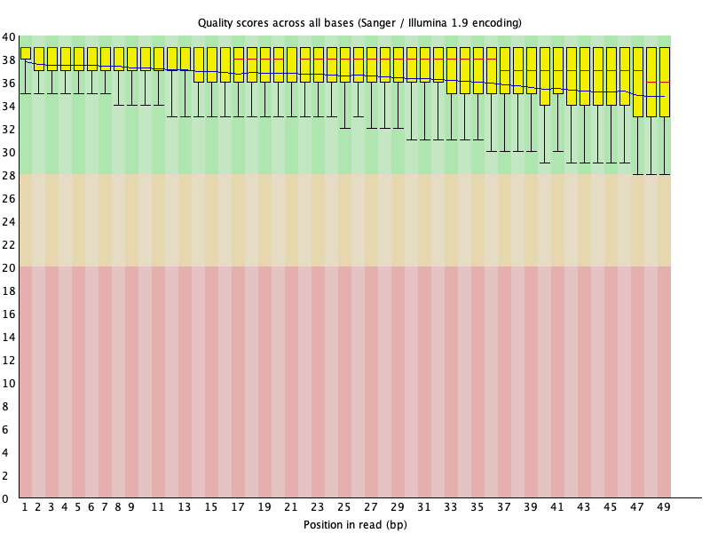
    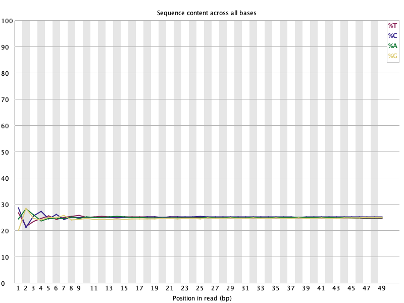
    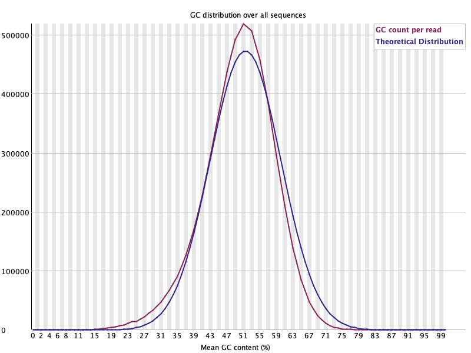
</div> <br/>

| Measure                          | Value                       |
|--------------------------------|----------------------------|
| Basic Statistics               | pass                       |
| Filename                       | SRR292862_S2_L001_R2_001.fastq |
| File type                      | Conventional base calls    |
| Encoding                       | Sanger / Illumina 1.9      |
| Total Sequences                | 5102041                    |
| Total Bases                    | 250 Mbp                    |
| Sequences flagged as poor quality | 0                          |
| Sequence length                | 49                         |

**SRR292770_S1_L001_R1_001_fastqc.fastq** 
<div style="display: flex; gap: 10px; align-items: center;">
    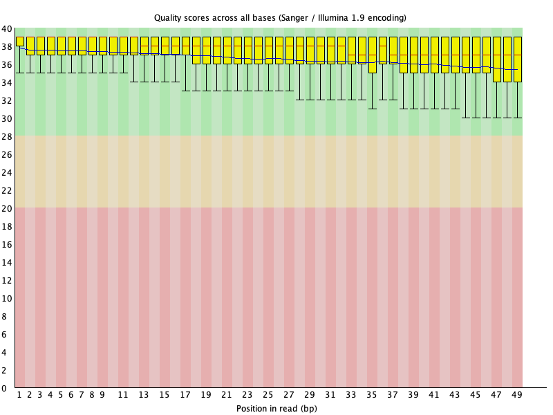
    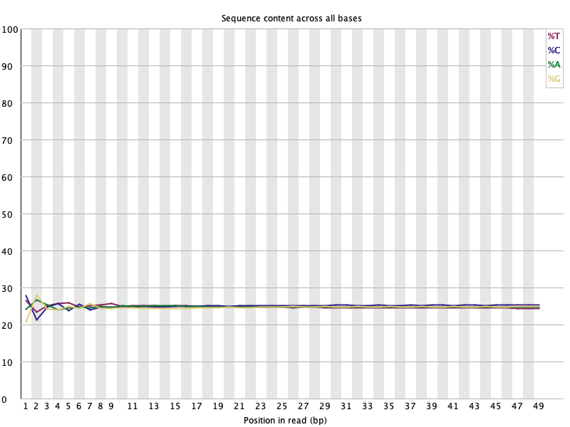
    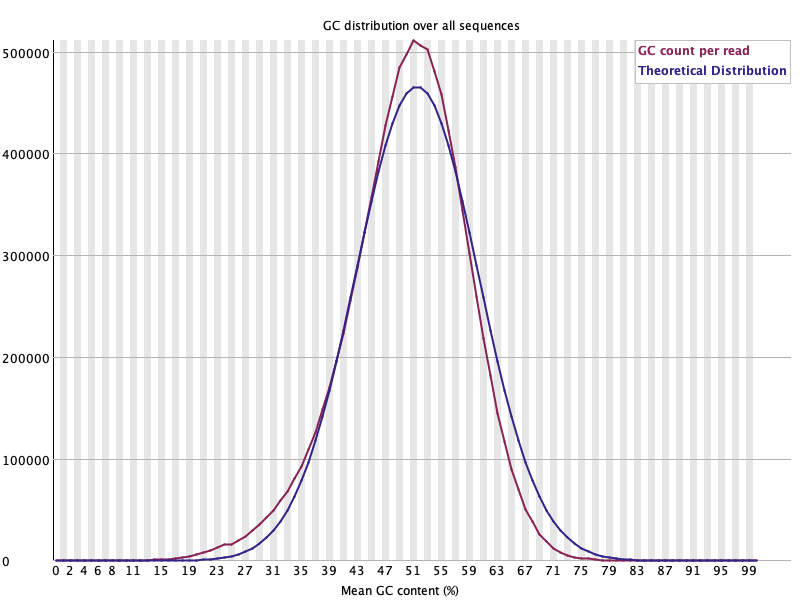
</div> <br/>

| Measure                          | Value                       |
|--------------------------------|----------------------------|
| Basic Statistics               | pass                       |
| Filename                       | SRR292770_S1_L001_R1_001.fastq |
| File type                      | Conventional base calls    |
| Encoding                       | Sanger / Illumina 1.9      |
| Total Sequences                | 5102041                    |
| Total Bases                    | 250 Mbp                    |
| Sequences flagged as poor quality | 0                          |
| Sequence length                | 49                         |

**SRR292770_S1_L001_R2_001_fastqc.fastq** 
<div style="display: flex; gap: 10px; align-items: center;">
    
    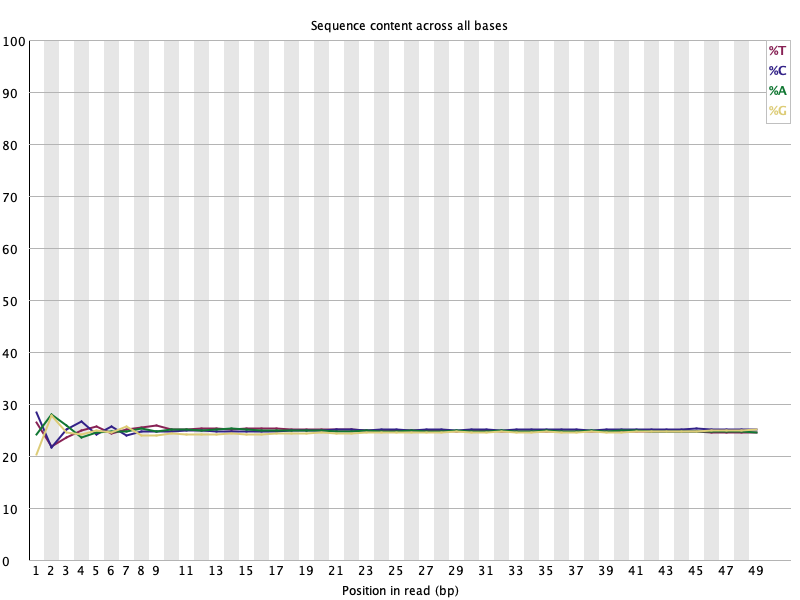
    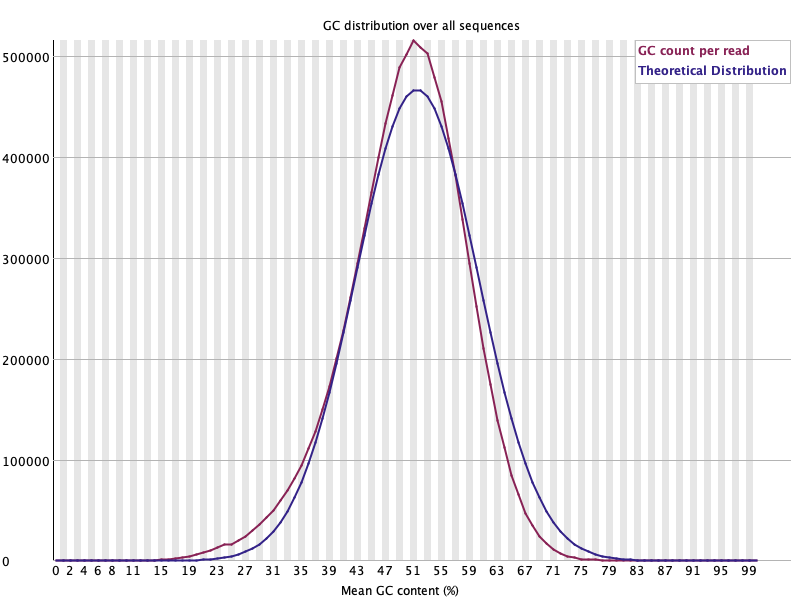
</div>

| Measure                          | Value                       |
|--------------------------------|----------------------------|
| Basic Statistics               | pass                       |
| Filename                       | SRR292770_S1_L001_R2_001.fastq |
| File type                      | Conventional base calls    |
| Encoding                       | Sanger / Illumina 1.9      |
| Total Sequences                | 5102041                    |
| Total Bases                    | 250 Mbp                    |
| Sequences flagged as poor quality | 0                          |
| Sequence length                | 49                         |


## 2. K-mer profile and genome size estimation

```
jellyfish count -m 31 -C -s 100M -o kmer_counts_31.jf SRR292678sub_S1_L001_R1_001.fastq SRR292678sub_S1_L001_R2_001.fastq
jellyfish histo -o kmer_histogram_31.txt kmer_counts_31.jf
```

<div style="display: flex; gap: 10px; align-items: center;">
    
    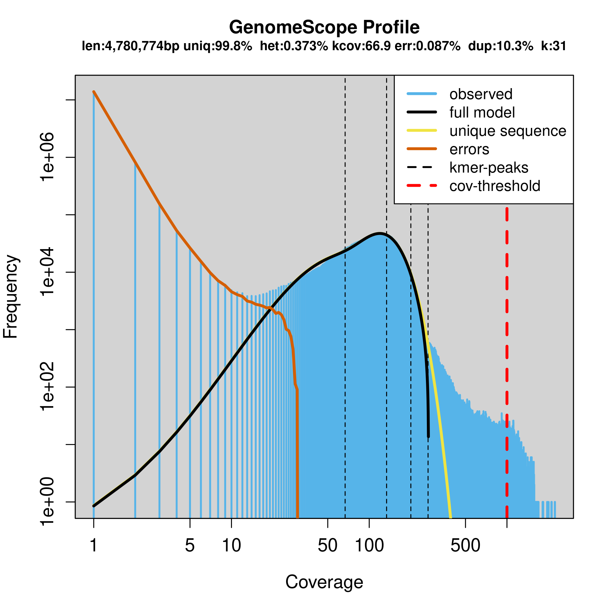
</div>

Results
```
GenomeScope version 1.0
k = 31

property                      min               max               
Heterozygosity                0.364681%         0.380497%         
Genome Haploid Length         4,761,140 bp      4,780,774 bp      
Genome Repeat Length          11,019 bp         11,065 bp         
Genome Unique Length          4,750,121 bp      4,769,709 bp      
Model Fit                     93.6457%          94.3204%          
Read Error Rate               0.0870234%        0.0870234%        
```

Model
```
Formula: y ~ (((2 * (1 - d) * (1 - (1 - r)^k)) + (2 * d * (1 - (1 - r)^k)^2) + 
    (2 * d * ((1 - r)^k) * (1 - (1 - r)^k))) * dnbinom(x, size = kmercov/bias, 
    mu = kmercov) * length + (((1 - d) * ((1 - r)^k)) + (d * 
    (1 - (1 - r)^k)^2)) * dnbinom(x, size = kmercov * 2/bias, 
    mu = kmercov * 2) * length + (2 * d * ((1 - r)^k) * (1 - 
    (1 - r)^k)) * dnbinom(x, size = kmercov * 3/bias, mu = kmercov * 
    3) * length + (d * (1 - r)^(2 * k)) * dnbinom(x, size = kmercov * 
    4/bias, mu = kmercov * 4) * length)

Parameters:
          Estimate Std. Error t value Pr(>|t|)    
d       -1.678e-02  2.661e-03  -6.305 4.37e-10 ***
r        3.726e-03  3.954e-05  94.233  < 2e-16 ***
kmercov  6.685e+01  6.878e-02 972.012  < 2e-16 ***
bias     1.026e+01  8.916e-02 115.026  < 2e-16 ***
length   4.682e+06  1.073e+04 436.263  < 2e-16 ***
---
Signif. codes:  0 '***' 0.001 '**' 0.01 '*' 0.05 '.' 0.1 ' ' 1

Residual standard error: 644 on 968 degrees of freedom

Number of iterations to convergence: 12 
Achieved convergence tolerance: 7.494e-06
```

N = (M*L)/(L-K+1)
Genome_size = T/N
(N: Depth of coverage, M: Kmer peak, K: Kmer-size, L: avg read length T: Total bases)

wc -l SRR292678sub_S1_L001_R1_001.fastq

 21997384 SRR292678sub_S1_L001_R1_001.fastq
 21997384 / 4 = 

N = 2.58
M = 
K = 31
L = 
T = 250 Mbp

Genome_size = T/N = /2.58 = 96938779.00 bp

Пиковая глубина (M): 1
Покрытие (N): 2.58
Размер генома: 96938779.00 bp


## 3. Assembling E. coli X genome from paired reads

```
conda install spades -c bioconda 
```

Запускаем ассемблер SPAdes в парном режиме, обеспечив парные считывания E. coli X. из библиотеки SRR292678 (прямое и обратное).

```
spades.py -1 SRR292678sub_S1_L001_R1_001.fastq -2 SRR292678sub_S1_L001_R2_001.fastq -o SRR292678 

```


QUAST
```
All statistics are based on contigs of size >= 500 bp, unless otherwise noted (e.g., "# contigs (>= 0 bp)" and "Total length (>= 0 bp)" include all contigs).

Assembly                    contigs 
# contigs (>= 0 bp)         369     
# contigs (>= 1000 bp)      79      
# contigs (>= 5000 bp)      33      
# contigs (>= 10000 bp)     30      
# contigs (>= 25000 bp)     26      
# contigs (>= 50000 bp)     22      
Total length (>= 0 bp)      5403327 
Total length (>= 1000 bp)   5331230 
Total length (>= 5000 bp)   5202939 
Total length (>= 10000 bp)  5183802 
Total length (>= 25000 bp)  5133691 
Total length (>= 50000 bp)  4975501 
# contigs                   105     
Largest contig              698474  
Total length                5350156 
GC (%)                      50.59   
N50                         335515  
N90                         79998   
auN                         319603.4
L50                         6       
L90                         20      
# N's per 100 kbp           0.00    
```


## 3a. Effect of read correction.

```
spades.py -1 SRR292678/corrected/SRR292678sub_S1_L001_R1_00100.0_0.cor.fastq.gz -2 SRR292678/corrected/SRR292678sub_S1_L001_R2_00100.0_0.cor.fastq.gz -o cor
```


```
gunzip cor/corrected/SRR292678sub_S1_L001_R1_00100.0_0.cor.fastq00.0_0.cor.fastq.gz
gunzip cor/corrected/SRR292678sub_S1_L001_R2_00100.0_0.cor.fastq00.0_0.cor.fastq.gz

jellyfish count -m 31 -C -s 100M -o cor/corrected/kmer_counts_31_corrected.jf cor/corrected/SRR292678sub_S1_L001_R1_00100.0_0.cor.fastq00.0_0.cor.fastq cor/corrected/SRR292678sub_S1_L001_R2_00100.0_0.cor.fastq00.0_0.cor.fastq
jellyfish histo -o cor/corrected/kmer_counts_31_corrected.txt cor/corrected/kmer_counts_31_corrected.jf
```


```
jellyfish count -m 31 -C -s 100M -o kmer_counts_31.jf SRR292678sub_S1_L001_R1_001.fastq SRR292678sub_S1_L001_R2_001.fastq
jellyfish histo -o kmer_histogram_31.txt kmer_counts_31.jf
```

<div style="display: flex; gap: 10px; align-items: center;">
    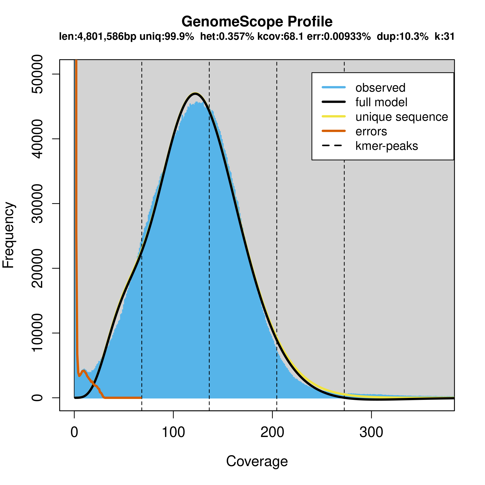
    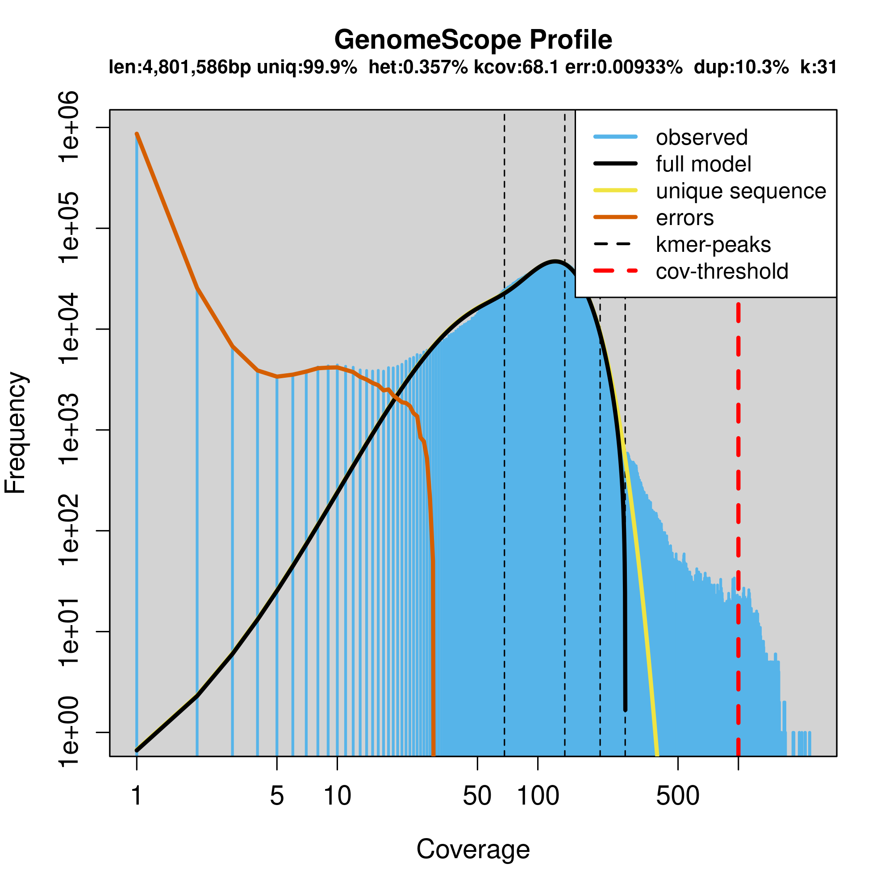
</div>


GenomeScope version 1.0
k = 31

property                      min               max               
Heterozygosity                0.349087%         0.365315%         
Genome Haploid Length         4,781,447 bp      4,801,586 bp      
Genome Repeat Length          3,687 bp          3,703 bp          
Genome Unique Length          4,777,760 bp      4,797,884 bp      
Model Fit                     93.42%            94.1025%          
Read Error Rate               0.00932989%       0.00932989%   


## 4. Impact of reads with large insert size

Run three-library assemblies: SRR292678 as a paired ends,  SRR292862 and SRR292770 as a mate pairs.
```
spades.py -1 SRR292678sub_S1_L001_R1_001.fastq -2 SRR292678sub_S1_L001_R2_001.fastq --mp1-1 SRR292862_S2_L001_R1_001.fastq --mp1-2 SRR292862_S2_L001_R2_001.fastq --mp2-1 SRR292770_S1_L001_R1_001.fastq --mp2-2 SRR292770_S1_L001_R2_001.fastq -o spades_output
```

Build QUAST report
```
python quast.py three_libs_spades_out/contigs.fasta  
```

| Metrics                         | single-library assemblies | three-library assemblies|
|---------------------------------|----------------------|----------------|
| Number of constants (>= 500 bp) | 210                  | 105            |
| N50                             | 111860               | 335515         |

The compilation using three libraries showed a significant improvement in quality:

- N50 increased from 111860 to 335515, indicating longer and better quality of the contigs.
- The number of contigs has been reduced from 210 to 105, which indicates a reduction in fragmentation.

Reasons for improvement

The compilation with three libraries uses different reading lengths (short-read and long-read), which allows:

- Reduce assembly gaps, especially in repetitive areas of the genome.
- More precisely define the order and orientation of the constants.
- Achieve more complete and continuous assembly.


## 5. Genome Annotation

Run PROKKA: 

```
prokka SRR292678/scaffolds.fasta
```
| Category           | Numbers |
|---------------------|------------|
| tRNAs              | 80         |
| rRNAs              | 0          |
| CRISPRs            | 1          |
| CDS                | 5064       |
| Unique gene codes  | 2923       |


## 6. Finding the closest relative of E. coli X

Run rRNA genes prediction tool Barrnap to find the 16S rRNA in the SPAdes output. 

```
barrnap scaffolds.fasta > barrnap_output.gff
grep "16S" barrnap_output.gff > 16S_output.gff
bedtools getfasta -fi scaffolds.fasta -bed 16S_output.gff -fo 16S_sequences.fasta
```

Enter FASTA sequences from `16S_sequences.fasta` file and choose refseq_genomes as database, *E. coli* (taxid:562) as organism, `1900/01/01:2011/01/01[PDAT]` in Entrez Query and megablast as BLAST algoritm. Other parameters should be specified as default.

<div style="display: flex; gap: 10px; align-items: center;">
    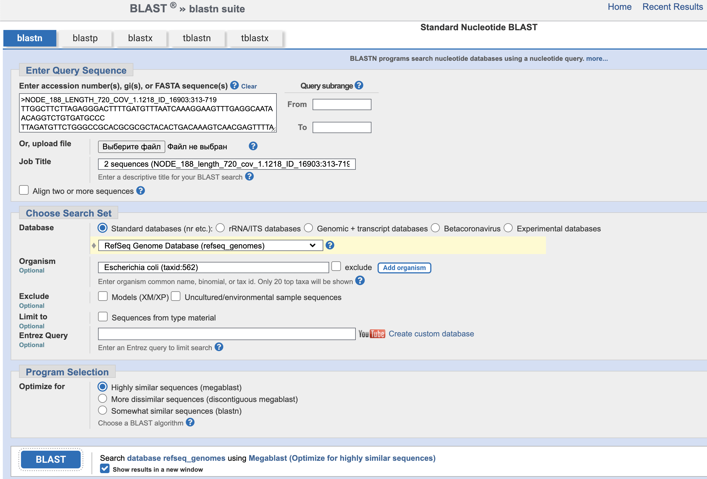
</div>

<br>
GenBank accession number of the reference E.coli strain. NCBI Reference Sequence, NC_011748.1.

<br>
<div style="display: flex; gap: 10px; align-items: center;">
    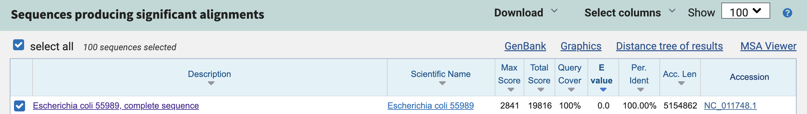
</div>

## 7. What is the genetic cause of HUS?

Align contig to reference using mauve
<br>
<div style="display: flex; gap: 10px; align-items: center;">
    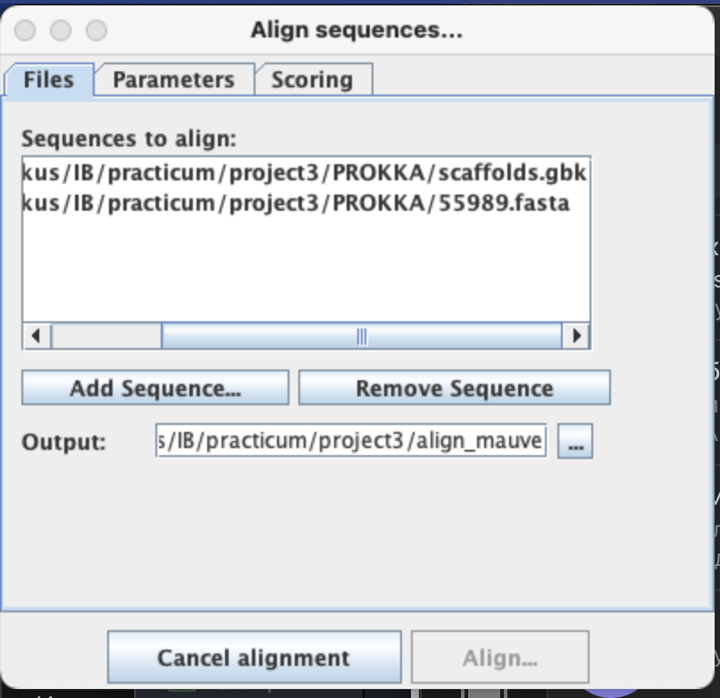
</div><br>

**Result**
<div style="display: flex; gap: 10px; align-items: center;">
    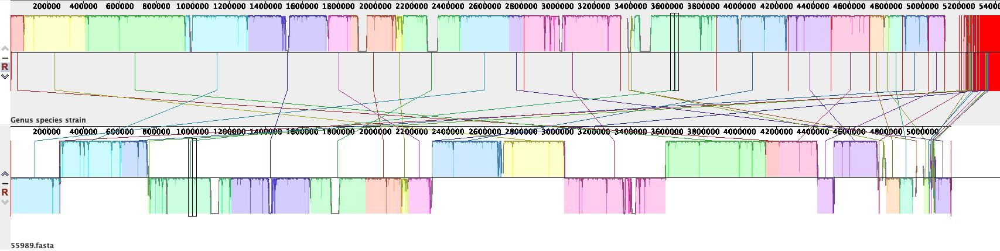
</div>


## 8. Tracing the source of toxin genes in E. coli X


## 9. Antibiotic resistance detection


## 10. Antibiotic resistance mechanism

